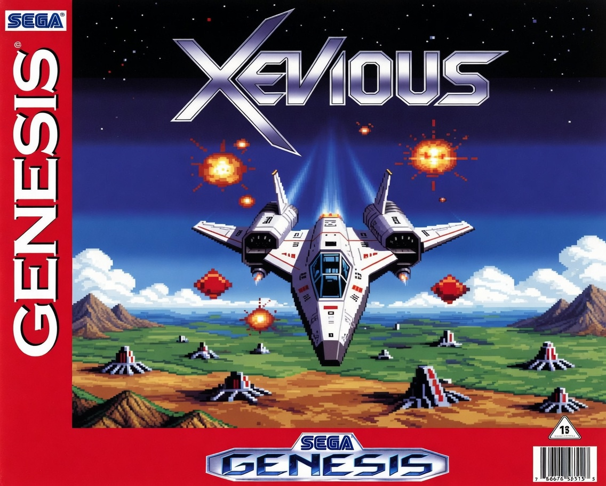
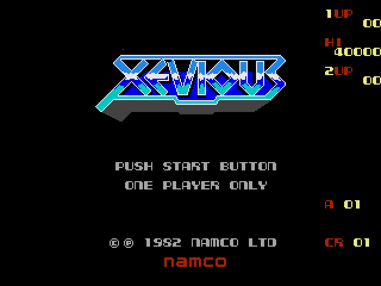
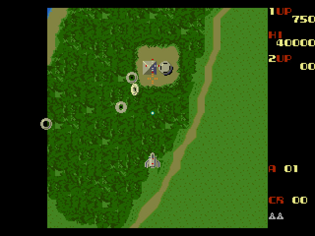
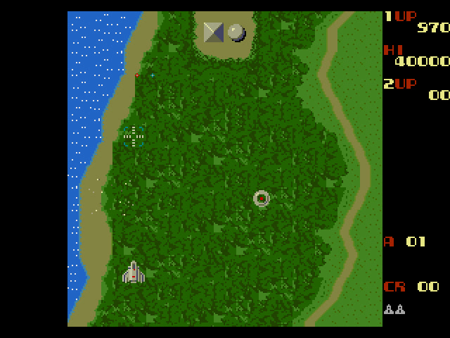
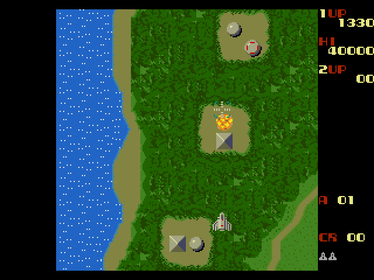

# Xevious — Sega Mega Drive / Genesis

<p align="center">
  
</p>

A faithful **Sega Mega Drive / Genesis** port of Namco's arcade **Xevious** (1982).

It is a third target for the [jotd666/xevious](https://github.com/jotd666/xevious)
line-by-line 68000 transcode of the arcade game, alongside the existing **Neo Geo**
and **Amiga** ports. The platform-agnostic game core is reused essentially
unmodified; everything Mega Drive–specific lives in `src/megadrive/` and
`assets/megadrive/`.

### ▶ Download / play: **https://sirvh.itch.io/xevious-genesis**

## Screenshots

|  |  |
|---|---|
|  |  |
|  |  |

## About this port

- Same gameplay as the arcade — the code *is* the reverse-engineered original
  logic (including the pseudo-random number generation), running on real
  Mega Drive features: VDP planes A/B, hardware sprites, a Window-plane HUD,
  CRAM palettes and DMA.
- **4-channel PCM** sound (music + SFX) through the SGDK PCM4 Z80 driver.
- 1P / 2P, attract mode, hi-score table, and high scores saved to battery SRAM.
- Runs on **BlastEm, Genesis Plus GX, Kega Fusion and PicoDrive** (NTSC, 60 Hz),
  and should run on real hardware.

Technical write-up (display mapping, the OSD layer, the sprite cache, sound):
see **[readme_megadrive.md](readme_megadrive.md)**.

### Controls (3-button pad)

| Input | Action |
|-------|--------|
| D-pad | move |
| B | zapper (air targets) |
| A | blaster (bomb, ground targets) |
| C | insert coin |
| Start | start game / pause |

### Known limitation

The arcade hardware had far more sprite budget than the Mega Drive (80 sprites
total, 20 per scanline, 320 sprite-pixels per line). Very busy scenes — notably
the large **Andor Genesis** fortress surrounded by enemies — can flicker, exactly
as many commercial Mega Drive games do. This is a hardware limit, not an emulation
bug: the Amiga port sidesteps it by drawing objects as blitter "BOBs" into a
framebuffer, which the Mega Drive's VDP has no equivalent for.

## Credits

- **Namco** — original *Xevious* (1982).
- **Mark McDougall (tcdev)** — reverse-engineering, the platform-agnostic 68000
  core, and the Neo Geo target.
- **Jean-François Fabre (jotd)** — Amiga target; the repository this is forked from.
- **Andrzej Dobrowolski (no9)** — Amiga music · **phx** — ptplayer replay code ·
  **DanyPPC** — Amiga icon.
- **Paulo Manrique** — this Sega Mega Drive / Genesis port.

The upstream README (Neo Geo / Amiga details and build instructions) is preserved
as **[readme_upstream.md](readme_upstream.md)**.

## AI disclosure

The Mega Drive–specific layer of this port (`src/megadrive/`, `assets/megadrive/`
and the build scripts) was developed with the assistance of an AI coding assistant
(Anthropic's Claude). The platform-agnostic game core, the original
reverse-engineering, and the Amiga / Neo Geo work are by the upstream authors
listed above.

## Building

Requires the SGDK m68k-elf toolchain and Python 3 with Pillow. Short version:

```sh
py assets/megadrive/convert_graphics_md.py   # arcade gfx -> MD tiles / palettes
py assets/megadrive/convert_sounds_md.py     # WAVs -> 16 kHz PCM samples
py build_md.py                               # assemble + link -> bin/xevious_md.bin
```

Full details (and the original Neo Geo / Amiga build steps) are in
[readme_megadrive.md](readme_megadrive.md) and [readme_upstream.md](readme_upstream.md).

## Legal

A non-commercial, fan-made port and a fork of
[jotd666/xevious](https://github.com/jotd666/xevious). *Xevious* and all of its
original graphics, sound and trademarks are property of Namco / Bandai Namco.
